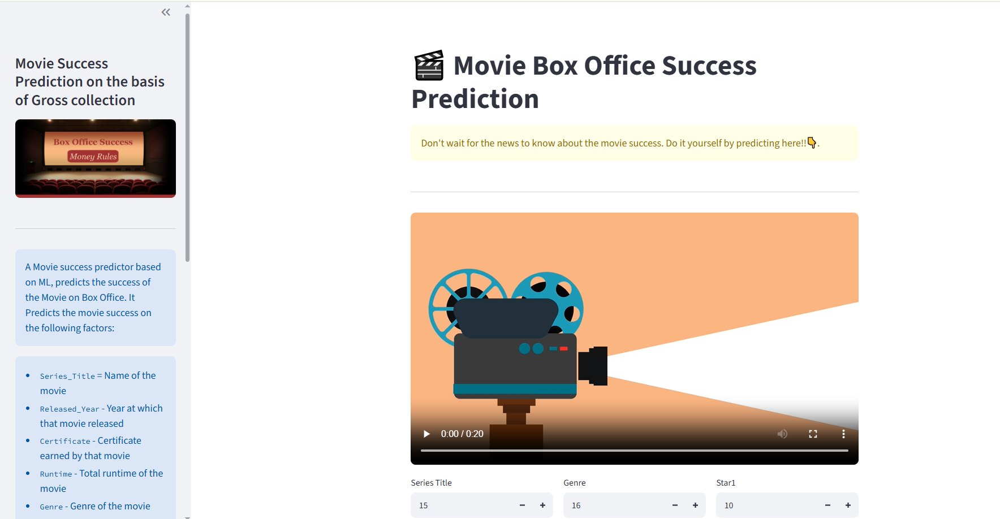

<div align="center">


# Movie Gross Prediction

### End-to-End Machine Learning Project for Predicting Movie Box Office Revenue


</div>

---

## Project Overview

Movie Gross Prediction is an end-to-end Machine Learning project that predicts the estimated box office gross revenue of a movie using historical IMDb movie data.

The project demonstrates the complete data science workflow, including data preprocessing, feature engineering, model development, model evaluation, and deployment using Streamlit. It enables users to estimate a movie's gross revenue based on key attributes such as genre, runtime, IMDb rating, director, and cast information.

---

## Technology Stack

| Category | Technologies |
|----------|--------------|
| Programming Language | Python |
| Libraries | Pandas, NumPy, Scikit-learn, Joblib |
| Framework | Streamlit |
| Visualization | Matplotlib, Plotly |
| Development | Jupyter Notebook, Git, GitHub |

---


## Project Structure

```
Movie-Gross-Prediction
│
├── Dataset
│   └── imdb_top_1000.csv
│
├── Image
│   └── boxoffice_image.png
│
├── Model
│   └── movie_model.pkl
│
├── Notebook
│   └── movies-success-prediction.ipynb
│
├── Social media icons
│   ├── csv.png
│   ├── github.png
│   └── linkedin.png
│
├── Video
│   └── movie_video.mp4
│
├── src
│   ├── main.py
│   ├── page_config.py
│   └── sidebar_ui.py
│
├── app.py
├── requirements.txt
├── LICENSE
└── README.md
```

---

## Model Information

Algorithm Used

- Linear Regression

Model Evaluation

- R² Score: **0.5135**
  
- The input to the model were normalized using StandardScaler.
- The trained model was serialized using Joblib and saved as a `.pkl` file for deployment in the Streamlit application.

---

## Application Workflow

1. Load the dataset
2. Clean and preprocess the data
3. Select relevant features
4. Scale numerical features
5. Train the Linear Regression model
6. Save the trained model
7. Launch the Streamlit application
8. Accept user inputs
9. Predict movie gross revenue

---

## Application Preview

The application provides an interactive interface for predicting movie box office gross revenue using Machine Learning.

<p align="center">
  
</p>

---

## Live Demo

Try the deployed application:

https://moviesuccess.streamlit.app/

---

## Dataset

This project uses the **IMDb Top 1000 Movies and TV Shows** dataset obtained from Kaggle. The dataset contains historical information about the top-rated movies and TV shows listed on IMDb, including their ratings, genres, directors, cast members, runtime, and box office gross revenue.

The dataset was used to train a Machine Learning model for predicting the **estimated box office gross revenue** of a movie based on its key attributes.

### Dataset Source

**IMDb Top 1000 Movies and TV Shows**  
https://www.kaggle.com/datasets/harshitshankhdhar/imdb-dataset-of-top-1000-movies-and-tv-shows

### Dataset Features

| Feature | Description |
|---------|-------------|
| Series_Title | Title of the movie |
| Released_Year | Release year of the movie |
| Certificate | Movie certification (e.g., U, UA, PG-13, R) |
| Runtime | Duration of the movie in minutes |
| Genre | Primary genre of the movie |
| IMDB_Rating | IMDb user rating |
| Meta_score | Metacritic score |
| Director | Director of the movie |
| Star1, Star2, Star3, Star4 | Lead cast members |
| No_of_votes | Total number of IMDb user votes |
| Gross | Box office gross revenue (Target Variable) |

---

## Data Preprocessing

The following preprocessing steps were performed before model training:

- Removed records containing missing values.
- Dropped irrelevant features (`Poster_Link` and `Overview`).
- Applied feature scaling using StandardScaler.
- Prepared the processed dataset for model training and evaluation.


---


## Repository Contents

| Folder | Description |
|----------|-------------|
| Dataset | Contains the IMDb dataset used for training |
| Model | Stores the trained Machine Learning model |
| Notebook | Contains exploratory analysis and model development |
| Image | Application images used in the project |
| Video | Demonstration video of the application |
| src | Source code for application components |
| app.py | Main Streamlit application |
| requirements.txt | Project dependencies |

---
## Future Enhancements

- Improve prediction accuracy using ensemble learning models such as Random Forest, XGBoost, and Gradient Boosting.
- Perform hyperparameter tuning.
- Implement automated feature selection.
- Add model explainability using SHAP.
- Deploy the application on Streamlit Community Cloud.
- Compare multiple regression algorithms for performance evaluation.


